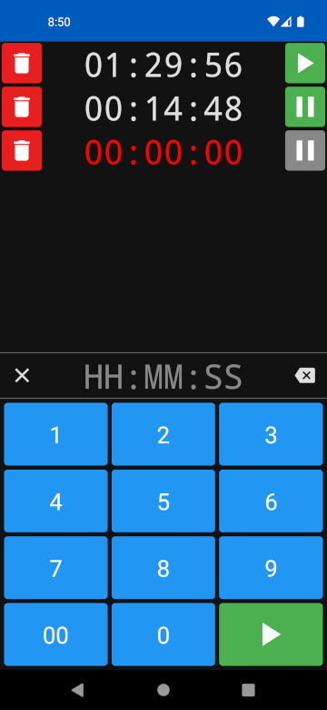

# Micro Timer

*Micro Timer* is a tiny, microwave inspired timer app for Android. Instead of inventing yet another clever, pretty, tedious method of inputing time, *Micro Timer* uses the tried and true 10-key pad commonly found on microwave ovens.

The idea was born when I realized I tended to use the kitchen microwave timer because the stock Android timer was such a pain to use. Not to mention it always seemed to change/break for no aparent reason between Android versions. I thought to myself, "Wouldn't it be nice if I could have my microwave timer with me wherever I went without having to drag around a microwave?"

